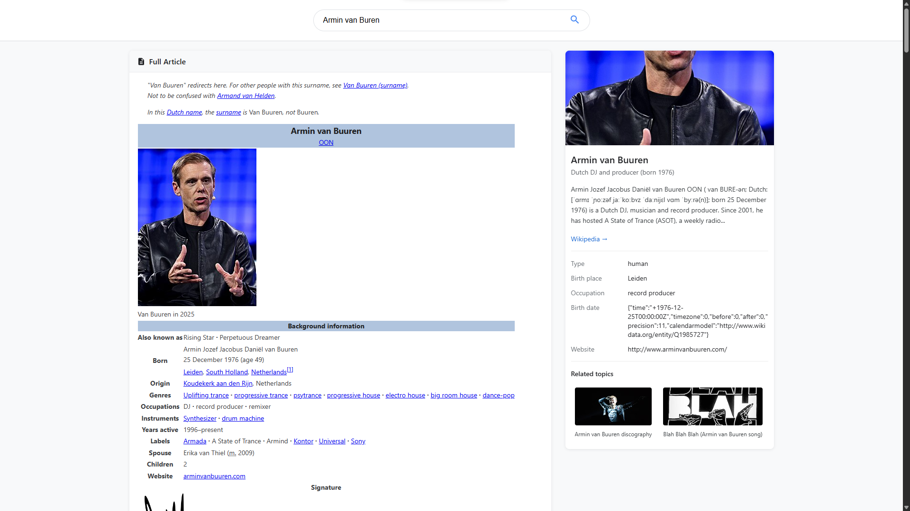

# wiki-knowledge

A single-file, browser-based Wikipedia “knowledge engine” UI.

It provides:
- A search box
- A knowledge card (image, description, facts, related topics)
- A left panel with full article, disambiguation, and a location section

## Screenshot

## Run

### Option 1: Open directly

Open `index.html` in your browser.

### Option 2: Serve locally (recommended)

Serving avoids some browser restrictions around local files.

Run one of the following in this folder:

- Python:

  `python -m http.server 8000`

Then open:

`http://localhost:8000/`

## Notes

The app fetches data from:
- Wikipedia API (`en.wikipedia.org`)
- Wikidata API (`www.wikidata.org`)
- OpenStreetMap embed (`www.openstreetmap.org`)
